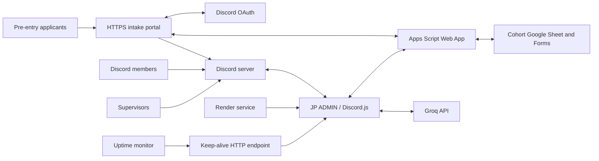

# Architecture and Execution Model

This document explains how the complete JP ADMIN project fits together. See
`FILE_CATALOG.md` for every file and `DATA_AND_STATE.md` for external API and
persistence contracts.

## System boundary

Discord is the user interface. The Apps Script Web App is the API layer over
Google Sheets and Forms. The Sheet is the durable database. Groq is optional
for AI-generated questions, scoring, interview preparation, matching, form
design, suggestions, and the command assistant.

`keepalive.js` also delegates `/intake/...` requests to `intake-portal.js` while
preserving `/` and `/health` for Render monitoring. The portal identifies the
applicant through Discord OAuth, renders the cohort's current editable
enrollment template, and saves one structured `Intake Responses` row before it
uses Discord's `guilds.join` grant. Only after Discord admission succeeds does
it call the existing active-profile pipeline. A saved application alone never
activates a student or creates attendance/job/outreach tracking rows.
Configured supervisors are an explicit exception to profile activation: their
portal smoke tests are stored and pass through the idempotent admission call,
but never call the student-profile pipeline.
The English-only default keeps the non-Discord STRIDE data-collection fields.
The immutable OAuth username remains in the fixed Discord columns, while the
portal's own rules commitment replaces the old pre-join Discord questions.
When the working template contains the built-in private placement questions,
their canonical gender/division/availability/study-stage values prefill the
existing onboarding record after admission. The member still accepts the rules
in Discord before the existing role assignment/finalization flow runs.

## Process startup

`index.js` is the only executable entry point.

1. Load `.env` through `dotenv`.
2. Load the environment bootstrap registry. When `COHORT_CONTROL_KEY` is set,
   load the durable managed registry from that control cohort's Apps Script
   state before any Discord handler or schedule is registered.
3. Validate the Discord token and every resolved cohort identity/backend field.
4. Construct one Discord client with guild, message, member, content, and
   reaction intents plus message/reaction partials.
5. Register always-on event handlers once.
6. Start the lightweight Render health HTTP server.
7. In managed mode, read the authenticated global backend schedule from the
   protected control Apps Script backend. If that read fails, use the validated
   `BOT_ACTIVE_WINDOW` fallback.
8. Connect to Discord only when the schedule's windows/day/date rules permit.
9. On `clientReady`, discover unresolved channels, then register attendance and
   the schedule-heavy question, job, workshop, RTBR, and resource modules.
   Student joins also enter a short per-guild batching queue; one full
   Discord-primary roster reconciliation runs after the burst, and once after
   startup, so direct-invite members receive provisional tracking rows even if
   they have not submitted private profile data yet.

Concurrent roster-refresh requests are coalesced per guild, and a successful
refresh may be reused for one minute. Historical job/outreach backfills can
fall back to the last durable roster when only the optional pre-scan refresh
hits a transient Google edge failure; public reports still fail closed rather
than using an unconfirmed roster.

Modules registered inside `clientReady` depend on a ready Discord client and
resolved channel configuration. Do not register them a second time elsewhere.

## Configuration modes

### Multi-cohort registry mode

`COHORT_REGISTRY_JSON` loads up to three enabled cohorts into one Discord
client and one Render process. Registry entries contain public identity,
timezone, supervisor, and optional channel data, while each Apps Script
URL/key is read from the separate environment-variable names referenced by the
entry. Startup rejects duplicates, missing credentials, more than three
enabled cohorts, or a mix of registry and generic single-cohort variables.

An explicit fourth bootstrap path, `JP_INSTALLER_MODE=true`, is reserved for a
mentor-owned single-server deployment created from `render.yaml`. It never
loads the legacy EJP fallback. The process logs in with setup-only listeners,
discovers or creates private `#bot-admin` after an administrator sends
`!setup`, and stores only signed non-secret Discord settings in a pinned
capsule. `COHORT_API_URL` and `COHORT_API_KEY` remain Render environment
values. On restart the capsule is verified with HMAC before the cohort is
activated and the ordinary event handlers and schedules are registered once.

All Discord events resolve their cohort by guild ID. Expensive scheduled work
passes through a process-wide concurrency-two quota queue, and volatile caches
use guild IDs rather than cohort display names. Each cohort still owns a
separate Apps Script/Sheet backend.

When `COHORT_CONTROL_KEY` is present, the environment registry becomes the
bootstrap and recovery configuration. `managed-cohorts.js` stores the active
registry, including per-cohort backend credentials, in a guild-namespaced
private state value in the protected control cohort's Apps Script backend.
`!cohorts` validates a new guild, Administrator permission, supervisors, and
backend health before saving that state. It then calls only this Render
service's secret deploy hook so startup and cron registration happen once.
Within an attached cohort, `!supervisor add/remove` changes only that guild's
supervisor list. It persists the same registry, reconciles standard private
overwrites, resyncs Discord-primary student tracking, and then requests the
same bounded restart. Self-removal is rejected to prevent an admin lockout.
No broad Render API key is stored in the bot. A managed-state read or
validation failure stops Discord login rather than silently reactivating an
environment-retired cohort.

There is no unified bot-admin channel or shared cohort command context. Every
server keeps its own configured `#bot-admin`, supervisors, channels, forms,
settings, automation switches, schedules, reports, onboarding state, and Sheet
data. For example, `!openform` resolves the command message's guild ID and calls
only that cohort's Apps Script backend and active attendance form. The shared
process owns only the Discord connection, global backend operating schedule,
quota queue, and explicitly configured cross-server forwarding. The schedule
is the narrow exception to server-local administration: `!backend` works only
in the protected control cohort's private `#bot-admin` for a supervisor common
to every active cohort. Its durable state drives both Discord connection timing
and the five-minute Render wake monitor, with multiple windows, repeating
weekdays, exact dates, and date overrides.

`work-calendar.js` adds a cohort-local global gate before every scheduled
feature-day check. The default workweek is Sunday–Thursday. A holiday override
blocks scheduled messages, checks, questions, workshops, warnings, and reports
for that local date. Its private selector covers the next 25 dates and keeps
the command path for arbitrary dates. Holidays do not block manual supervisor
commands or event-driven outreach/interview/successfully-hired ingestion, so
updates remain aligned without automated holiday reports. A date-specific working override permits
ordinary daily automation even when an older daily feature schedule omitted
that weekday; fixed weekly publications keep their intended day.
`runtime-schedule.js` enforces the holiday decision before every clock-based
handler, while feature-level schedule checks remain a second boundary. The
workshop minute loop uses the same calendar through its own explicit gate.

### Legacy mode

When none of the generic cohort identity variables exist, `config.js` loads the
hard-coded EJP-13 cohort and reads its API URL/key from environment variables.
This preserves the original deployment.

### Isolated deployment mode

Setting any of these variables activates isolated mode:

- `COHORT_NAME`
- `COHORT_GUILD_ID`
- `COHORT_API_URL`
- `COHORT_API_KEY`
- `COHORT_SUPERVISOR_IDS`

Startup validation requires the complete identity/backend set. Isolated mode
loads one cohort only, preventing a second Render service from running EJP-13
schedules or reading its backend.

The isolated mode remains a rollback path; it is no longer the preferred
topology for up to three concurrently active bootcamp servers.

`COHORT_CHANNELS_JSON={}` allows channel discovery and `!setupserver` to fill
the channel map at runtime. Explicit valid IDs take priority over name matching.

## Event architecture

Most feature files export `registerFeature(client)` and attach one or more
Discord handlers. Handlers follow this expected gate order:

1. Ignore bot-authored messages/reactions when appropriate.
2. Return unless the message or interaction belongs to the feature.
3. Resolve the cohort with `cohorts.find(c => c.guildId === event.guildId)`.
4. Check supervisor ID for administrative commands.
5. Check the required channel for channel-scoped behavior.
6. Read/write Apps Script or Discord state.
7. Report operational success/failure where useful.

There is intentionally no central command router. Each module owns its own
early-return handler, so command collisions and duplicate registration must be
checked during changes.

## Shared layers

| Layer | Modules | Responsibility |
| --- | --- | --- |
| Configuration | `config.js`, `discover.js`, `channel-names.js` | Cohorts, channels, schedules/defaults, template matching |
| Identity | `roster.js`, `discord-members.js`, `sync-command.js`, `missing.js`, `exclude.js`, `student-access.js` | Discord ↔ Sheet member mapping, eligibility, mutually exclusive status roles, and role/channel access rules |
| External APIs | `groq.js`, `apps-script-api.js`, feature modules | AI queue/key rotation plus bounded, secret-safe Sheet Web App calls; reads/idempotent writes retry transient edge, network, timeout, and Apps Script lock failures, use a remote-completion grace after timeouts/locks, and confirm an isolated authentication rejection once |
| Runtime control | `automations.js`, `settings.js`, `scheduler.js`, `runtime-schedule.js`, `control-center.js`, `help.js`, `state.js` | Persistent switches, targets, editable local clock times, day schedules, private overview, searchable command catalog, warm-up |
| Reporting/health | `reporter.js`, `doctor.js`, `perms.js`, `keepalive.js` | Activity logging, diagnostics, permissions, Render health |
| Pure logic | `job-tracker.js`, `message-chunks.js`, `onboarding-groups.js`, `dawn-attendance.js`, `channel-names.js`, `forwarder-route.js` | Testable parsing/distribution/normalization without Discord |

## Major feature flows

### Member identity flow

`roster.js` loads `Bot_Map` plus manual exclusions through one `action=roster`
execution and caches them for ten minutes. Discord membership is the active
roster source of truth. `!syncmembers` submits only current non-bot,
non-supervisor members to Apps Script v48, which corroborates current or
archived Discord IDs, unique normalized names, `All Data`, and enrollment
identity fields before rebuilding `Bot_Map`. `All Data` is the preferred
contact/location source and `Bot_Map Archive` fills missing historical region
and subregion values. Submitted usernames are hints, never proof by themselves.
Every eligible member is written to `Roster Review`. Supervisor edits in
columns E:I are durable inputs on later syncs. A member without a verified
Sheet match receives a unique provisional internal email and is still written
to Bot_Map, All Data, Attendance, Jobs Applied, Outreach Update, Interview Updates, and Job_Sheets;
the profile remains visibly incomplete until a real email/contact profile is
collected. Replacing a provisional email migrates operational identity rows and
history instead of creating a disconnected duplicate. No current eligible
Discord member is omitted merely because no verified email mapping exists.
Onboarding division may fill a missing profile region without exposing
private onboarding answers in Discord. Portal-admitted members get a short
profile synchronization grace period so the normal join handler does not send
a redundant missing-data DM when all five private identity fields already exist.

Student-facing attendance, nightly jobs, and outreach reports refresh the
Discord-primary roster before calculating results. Tracker-link, outreach, and
interview event handlers also refresh and retry once when a current server
member is not yet present in the cached roster. If a required report preflight
fails, the run stops with a private supervisor error instead of silently
publishing a partial list.

`!missingdata` is a supervisor-only dashboard in `#bot-admin`. `!profilecheck`
first refreshes Discord-primary capture and reports end-to-end profile
coverage. `!profilesurvey #channel` publicly mentions only incomplete members;
its button opens a private Discord-ID-bound modal. The dashboard reads a
minimal missing-field view from `Roster Review` and, after a button
confirmation, DMs only affected current members. The student modal requests at
most the missing full-name/email/phone/region/subregion fields; Discord ID and
username come from the live member. Successful submissions fill blank `All
Data` values and synchronize Bot_Map, Attendance, all three activity matrices, and
Roster Review without posting or returning the private answers. Existing
non-empty master values are never silently overwritten by a student. New
members receive the required five-field profile form in DM immediately after
joining, and the welcome panel provides the same private-form button when DMs
are unavailable. `!editprofile @student` lets a supervisor authoritatively
correct all five fields in `#bot-admin`; an email correction migrates historical
identity rows rather than creating a duplicate. Discord's native pre-join
Onboarding remains suitable for role/channel choices, but private free-text
email and phone collection starts from a bot interaction after the member joins.
Form submissions enrich `All Data` but never activate a student. `!audit`
performs a two-way check and `!addstudent` remains the supervisor fallback.
Almost every student feature uses `isExcluded` so supervisors, intentionally
colored identity rows in `Bot_Map` or `Attendance`, hired/left students, and
manual exclusions are skipped consistently. The backend treats very bright,
near-neutral theme fills as visually white and returns exact color reasons in
private audits, avoiding false exclusions from Google theme whites.
`hired.js` additionally creates/reuses one Discord Hired role,
assigns it on new hires, and performs an idempotent delayed startup repair for
existing explicit `Status = hired` members.

### Attendance flow

Supervisors open/close the active Google Form through `formcontrol.js`.
`!closeform` waits briefly and calls `attendance.js`, which reads the computed
attendance result from Apps Script and posts a summary plus real absent mentions.
Scheduled reminders alert supervisors if the form state is not as expected.
The backend resolves attendance through collected email, the configured answer,
exact roster name, Discord username, or Discord ID. Ambiguous/unmatched answers
are never guessed and are returned only for a private bot-admin review notice.
Attendance form submissions themselves do not mutate the matrix. The immutable
Google Forms `Timestamp` always determines the attendance day; the editable
date answer is audit-only and can never move a response. The report
request performs one idempotent batch matrix reconciliation. Rolling history
uses only recorded matrix dates on or before the report date and merges
duplicate student/date cells with P/L precedence. The latest same-day Form
submission controls mood/interview summaries, and an explicit no-interview
confirmation vetoes a contradictory Yes. The shared form trigger continues to
process enrollment submissions.

Apps Script v48 also exposes a private date-bounded absence report and
attendance roster/response audit. The Node
side parses `current`, `previous`, a date, or month-week phrases such as
`july week 1`, then renders contact-rich TSV only inside `#bot-admin`. After
attendance reconciliation, the backend marks only blank cells in qualifying
three-or-more recorded-session absence runs from the current or previous week;
`P` and manual notes remain authoritative.

Form definitions originate in `form-templates.js`. `cohort-admin.js` stores the
working enrollment and attendance definitions separately in guild-namespaced
Apps Script state and can copy them into named reusable pairs. Creation sends a
validated definition to Apps Script v48, which supports text, paragraph,
choice, checkbox, scale, date, and time fields. Semantic field keys are saved
with the created Forms so edited student-facing wording does not break roster
or attendance header lookup.

### Jobs flow

Students post public Google Sheet tracker links in the configured job-tracking
channel. `jobs.js` associates links with roster members and persists the sheet
ID plus selected `gid`. `job-tracker.js` fetches a fresh Visualization response
with a unique request ID and no-cache policy, requires a defensible
application/date header, normalizes dates in the cohort
timezone, counts matching rows, and reports malformed dates. Transient fetches
retry once; unsafe inferred headers trigger bounded explicit-header fallbacks,
including embedded/multi-row headers. When Visualization itself fails, the
reader tries the same public tab's CSV export while preserving the saved `gid`.
For a legacy link with no selected GID and an unusable default tab, it performs
bounded public-tab discovery. Nightly checks also inspect alternates when the
selected tab has no requested-date rows. The private audit deeply inspects up
to 30 public tabs and selects the defensible table containing the requested
date. An explicitly submitted GID is never overwritten; only a legacy DEFAULT
link may persist an automatically resolved tab.
If a recognizable application table truly
has no date column, v23+ stores a bot-owned row-count baseline and uses only the
non-negative change since the previous successful nightly observation. Google
Drive revisions are not used because they identify file revisions, not the date
of individual application rows.
`message-chunks.js` guarantees that malformed tracker metadata cannot exceed
Discord's message limit and abort the remainder of a report.

One `jobaudit` backend execution supplies roster, exclusions, tracker references,
private contacts, and saved counts to a check/audit, avoiding several concurrent
Apps Script reads. The nightly check intentionally sends real student mentions/`@everyone` and
upserts readable counts into `Jobs_Daily`. `!checkjobsheets [YYYY-MM-DD]` uses
the same reader but is a private, non-writing, non-pinging supervisor audit;
phone and WhatsApp data are added only inside `#bot-admin`.

`weekly-report.js` rereads trackers for the current Sunday-to-report-date range,
falls back to durable daily counts when a tracker is unavailable, combines the
Apps Script `performance` aggregates, and publishes a contact-free ranking to
`#discussion` every Thursday at 18:00. Applications and attendance are the two
primary ordering metrics. `weekly-targets.js` derives applications/outreach
goals from their daily target and scheduled days, and carries fixed weekly
attendance/interview/communication/workshop goals into public and private
progress output. `student-reports.js` exposes the same aggregates,
contacts, and serialized interview history only in `#bot-admin`. Its
needs-attention choice uses only the two primary metrics and flags applications
or attendance below half of their configured period target.

`Jobs_Daily` and `Outreach_Daily` remain the durable activity logs. Outreach
events carry immutable Discord message IDs, so live retries and history
backfills cannot inflate totals. Structured interview announcements are parsed
deterministically and bulk-upserted under one Apps Script lock. Discord message
ID plus zero-based event index is the durable identity, so gateway retries,
link-preview updates, overlapping handlers, and real message edits cannot
inflate `Interview_Log` or send duplicate replies. Groq adds optional prep
guidance but is no longer required for a durable event. `!checkpipelines` provides one
private, failure-isolated audit across identity/color state, Attendance,
trackers/counts, outreach, and interviews; `!repairpipelines` repairs identity
rows and schemas without deleting activity history.
`activity-reconciliation.js` runs one bounded, silent interview/outreach
history repair at the configurable default 22:50 on every calendar day. It is
separate from public reports, workday/holiday decisions, and feature switches;
message IDs make repeated weekend and restart recovery safe. Manual and silent
activity backfills default to three cohort calendar days and stop pagination at
the first older message; supervisors may request 1-30 days explicitly. Outreach
history is sent to Apps Script in batches of 25 so each locked execution remains
well below the long-request timeout and does not create a retry/lock collision.
`activity-automation.js` adds cohort-local Sun–Thu templates and evidence-based
follow-up. Its automatic consecutive-attendance warning runs every working day;
the two-working-day application escalation runs Monday and Wednesday, while manual
private command remains available any day. It refreshes the Discord-primary
roster before warning, uses the backend's recorded attendance/application/interview facts, and posts only
mentions/counts—never contacts or private Sheet rows. `dawn-discipline.js`
uses approved leave from the cohort backend to prevent both Attendance and Dawn
absence penalties. `leave.js` owns the private `#issues` request modal and
serializes submissions and decisions per cohort. The Apps Script ledger is the
idempotent integrity boundary: duplicate pending requests do not create a
second bot-admin card, every decision requires a mentor note, and the result is
posted in `#issues` mentioning only that student. Approvals write `L` through
the same ledger. `followup.js` is a separate manual preview/confirmation layer. It reads
the same durable metrics but never mutates automation switches or schedules.
`activity-automation.js` stores a guild-namespaced warning incident counter and
uses one inclusive cohort-wide start date. The normal check is queued ten
minutes after a successful non-silent attendance close/report on every
working day, with an idempotent morning recovery check. Each run can add only
one warning and consumes two new consecutive recorded-session absence dates;
present or approved-leave marks break the run, backlog cannot instantly
eliminate a student, and retries cannot reuse a pair;
the third warning represents six counted absence dates and reuses the normal
inactive list. `warning-controls.js` owns inspection/reset and a Thursday-only
private inactive/warning/absence/contact report. Its baseline command rebuilds
evidence from recorded Attendance data and reactivates only invalid
warning-driven inactive states. Reactivation runs a fresh
Discord roster sync, clears manual and color-based Bot_Map/Attendance inactive
markers in Apps Script, resets warnings, and reloads the roster before success
is reported. `inactive-controls.js` presents that same verified path as a
private `!studentstatuspanel` count dashboard plus paginated active and inactive
lists. Individual inactivation, date-group activation, and all-student actions
require confirmation. Every component is acknowledged before remote I/O so an
expired interaction cannot crash the process. Apps Script v51 applies each
activation/inactivation batch under one lock: exclusion state, inactive
metadata, warning reset, and Sheet status colors change together, followed by
one Discord roster verification. Durable metadata records the inactive
date/source/reason without inventing dates for legacy records. Hired/left
statuses are never silently reactivated. The weekly warning report permits a
30-minute recovery window and persists its completed cohort-date so slow reads
or a restart cannot skip or duplicate it.

`student-access.js` projects that verified Sheet status into Discord. Every
tracked member has exactly one `Active Student` or `Inactive Student` role;
hired/left students have neither, and receiving the Hired role clears both.
New joins, startup, roster sync, activation, and inactivation all reconcile the
projection. Guild-namespaced `student_access_rules_v1_<guildId>` state stores
role/channel View Channel rules. `!accessrules defaults` hides the discovered
job-post channel only from Inactive Student, while allow/deny/remove can
optionally restrict Hired or any other role and
target any role and text channel in the same cohort.

The opt-in `mailer.js` step runs only after the ten-minute warning
classification, never before it. The report-date work calendar controls this
follow-up; a legacy/custom `sched_attendancewarning` value cannot suppress mail
or a working-day warning. A guild-namespaced durable pending record is written
before the timer starts, recovered after a Render restart, and completed only
after both enabled stages finish. It derives four mutually exclusive BCC groups:
ordinary absence, warning 1, warning 2, and warning 3/inactive. A warning group
supersedes ordinary absence for that date, and warning 3 is eligible only on
the actual inactivation date. Apps Script v51 reserves a unique
guild/date/type/part row in private `Mailer_Log` before calling `MailApp`, so a
Render retry cannot duplicate a sent or in-progress batch. To/CC are mentor
headers; students are always BCC-only. Manual previews reconcile the complete
Attendance absence count against eligible recipients plus already-inactive,
invalid-email, duplicate-email, and unresolved rows, and attach the private
recipient/skipped-reason TSV in `#bot-admin`. Manual runs require confirmation,
while automatic delivery is disabled by default.

`appeals.js` owns the mobile-first restriction appeal flow. Bootcamp and Dawn
buttons are bound to guild, scope, and user; cause selection opens a short modal
for affected dates and explanation. Apps Script v51 stores one pending appeal
per student/scope in `Appeal_Logs`; review cards and private contact values are
sent only to bot-admin. Approval restores only the requested scope. Discord
cannot display a bot-defined form before a member enters a guild, so an inactive
rejoin receives a DM and, if DMs are blocked, a restricted-channel fallback.
`dawn-discipline.js`
owns the optional private Dawn Focus Circle role/normal-text channel. It keeps
student thread creation denied, independently applies an optional sending
window, sends one prompt at the configured start, scans only the completed
configurable Sunday–Thursday attendance window (default 05:00–07:00) once at
07:10, writes one idempotent horizontal `Dawn_Attendance` batch,
then applies the three-miss permit/removal policy and
private permit rules. Rare Dawn role additions/removals use
`saveDawnMembershipEvent`, including manual changes and bot-enforced removal or
rejoin, without storing Discord identifiers in the matrix. `!dawn sync` uses
one `syncDawnMembers` write to reconcile all current role members and offline
removals, updating identity/contact cells without creating attendance marks or
deleting history. `content-sync.js` keeps an
independent destination cursor and a secret-free snapshot of the selected old
cohort, allowing bounded Resources and Job Hunting history transfer without
reactivating the retired cohort's automations.
`!setupsheets` creates or rebuilds `Jobs Applied`, `Outreach Update`, and
`Interview Updates` as horizontal matrix views with frozen identity/contact
columns and scrollable date columns. Each is reconstructed from its durable raw
log. Outreach duplicate retries reconcile downstream summary/matrix state after
partial writes. After three recorded date columns exist, active, non-excluded
job/outreach rows below ten combined events are light red. Inactive rows in all
three matrices and Attendance are dark red until verified mentor activation.
Attendance has a fixed manual `Remarks` column before date columns; bot repairs
and report reconciliation never overwrite its values.
`!arrangesheets` renames the configured active response tabs to
`Enrollment Responses` and `Attendance Responses`, then groups blue
manual-review tabs first, green active forms/reference tabs next, yellow
unassigned Form-like tabs for review, and gray bot-maintained tabs last. Custom
tabs remain visible.

`!setupcohortsheet [Google Sheet URL]` binds a backend to its Sheet and
creates/repairs all required operational tabs plus the single form-submit
trigger. Repair mode is non-destructive. Cleanup mode copies every current tab
to a separate safety workbook
before deleting only obsolete, unlinked Form-response tabs. Every tab still
linked to any Google Form is preserved. Fresh mode
also requires empty operational history and rebuilds bot-owned tabs with clean
formatting so copied colors/rows cannot leak into a new cohort. `All Data` and
unknown/custom tabs are preserved.

### Question and scoring flow

`questions.js` and pure `question-plan.js` plan exact morning, afternoon, and
evening drops. The default 06:30 planner schedules two questions at 07:00, two
at 13:00, and two at 18:00; startup recovery schedules only remaining same-day
drops. The effective gap is always longer than `qwindow`, preventing overlap.
Questions come from `Question_Bank`;
empty categories are replenished through Groq. Answers are evaluated through
Groq, logged to `Scores`, and contribute to leaderboard/weekly/RTBR reports.
Question windows and first-answer state are process memory, so an in-window
restart loses only the open window, not persisted scores.

All daily clocks use `runtime-schedule.js`: one minute tick compares the saved
`HH:MM` with the cohort's local time and allows one execution per
cohort/task/date. Public automation uses the work-calendar variant; silent
history reconciliation explicitly uses the calendar-day variant. `settings.js` shares a 30-minute backend cache, and Discord
writes invalidate it immediately, so `!time` applies live without generating a
Sheet request per feature per minute. Feature handlers still enforce their own
automation switch, day schedule, and warm-up rules. `!control` is a read-only
private view over these existing guild-namespaced controls.

### Workshop flow

`workshop.js` runs a minute tick because session times are runtime settings.
Its daily and Dawn-special switches are independent. At the configured time it
posts a private confirmation card in `#bot-admin`; no public announcement is
sent until a configured supervisor confirms, and the switch is rechecked at
click time. Only a confirmed daily announcement enables that day's reminders,
polls, attendance writes, and no-show report. Special workshops post only to
the private Dawn Focus Circle role/channel.

### Cross-server job forwarding flow

`forwarder.js` runs only against the process's primary cohort. A configured
owner's new messages in the source job-post channel are copied to one
destination channel visible to the same Discord bot; forwarded edits sync only
while the process-local message map survives. Commands are private to
`#bot-admin`. Route changes validate source/destination access and leave the
forwarder off until a deliberate `!forwarder start` passes the same live check.
Once enabled, a transient startup/channel lookup failure leaves durable ON
intent intact, reports WAITING, and retries every five minutes and on the next
matching post. `!doctor forwarder` exposes this state.
`forwarder-route.js` owns the pure persisted-route selection and one-time
deprecated-destination migration. Forwarded text suppresses mentions so an EJP
role or `@everyone` cannot accidentally notify STRIDE members.

### Onboarding flow

`onboarding.js` posts a public welcome and rules link but collects answers through
ephemeral selects. Apps Script state persists gender preference, division,
availability, study stage, acceptance, group, and completion timestamps.
Bulk member lists use the shared rate-limit-aware `discord-members.js` cache;
the onboarding serialization queue consumes both success and rejection paths
so a Discord opcode-8 rate limit cannot terminate the process.

After gender/division, a queued assignment gives a probable fruit team role.
`onboarding-groups.js` owns the pure final distribution: same division, maximum
six, and declared female/male separation where possible. Strict majority
completion triggers finalization; completed late voters trigger rebalancing.
Readiness roles are independent of identity roles.

`group-activities.js` consumes only these identity-region roles. It creates or
reuses `#group-activities` and one private thread per populated role, adding
the role members individually because Discord private threads cannot directly
grant membership to a role. Readiness roles are never used for these threads.

### New-server setup flow

`setup-command.js` examines configured channel IDs, then normalized names and
aliases. It reuses recognized template text channels, repairs private/locked
permissions, and creates only missing standard channels. It runs discovery,
records the three-day warm-up, posts channel introductions, and establishes the
rules message and persistent onboarding panel.

## Persistence model

Durable data belongs in the cohort Sheet/Apps Script state. Process-local data
is limited to:

- five- or ten-minute read caches;
- Groq request queue and key index;
- five-minute `!jp` clarification prompts, keyed by guild, channel, and mentor;
- current question/poll windows;
- pending reaction approvals, including 15-minute AI form-design approvals;
- forwarder edit-sync map;
- daily in-memory operational report entries;
- onboarding serialization queues.

Any new state that must survive a Render restart must be stored through Apps
Script, preferably using a guild-namespaced state key.

## Permission model

Supervisor authority is based on Discord user IDs in `supervisorIds`, not a
role name. `!setupserver` grants those users access to `#bot-admin`. The bot
needs channel read/send/embed/history permissions and, for setup/onboarding,
Manage Channels, Manage Messages, and Manage Roles. Discord role hierarchy still
controls which roles the bot can assign.
`!repairpermissions` reapplies only private/locked standard overwrites with
explicit Discord Role/Member types, avoiding duplicate setup announcements.

## Testing architecture

Node's built-in test runner is used; there is no test framework dependency.
Tests intentionally target pure boundaries:

- environment isolation in `config.test.js`;
- decorated channel names in `channel-names.test.js`;
- Google tracker link/date/table parsing in `job-tracker.test.js`;
- Render-compatible HTTP host binding and query-safe health checks in `keepalive.test.js`;
- transient Apps Script edge-response retry rules in `apps-script-api.test.js`;
- the cross-midnight two-service wake-up window in
  `render-uptime-monitor.test.js`;
- legacy forwarder destination migration in `forwarder-route.test.js`;
- explicit Discord overwrite target types in `setup-permissions.test.js`;
- bilingual form defaults, field syntax, semantic keys, and core restoration in
  `form-templates.test.js`;
- group capacity/division/gender rules in `onboarding-groups.test.js`.
- Apps Script syntax/action and safety contracts in
  `apps-script-contract.test.js`.

Live Discord, Apps Script, Render, Google Forms, and Groq behavior is validated
operationally with `!checkperms`, `!doctor`, targeted supervisor commands, and
service logs.
