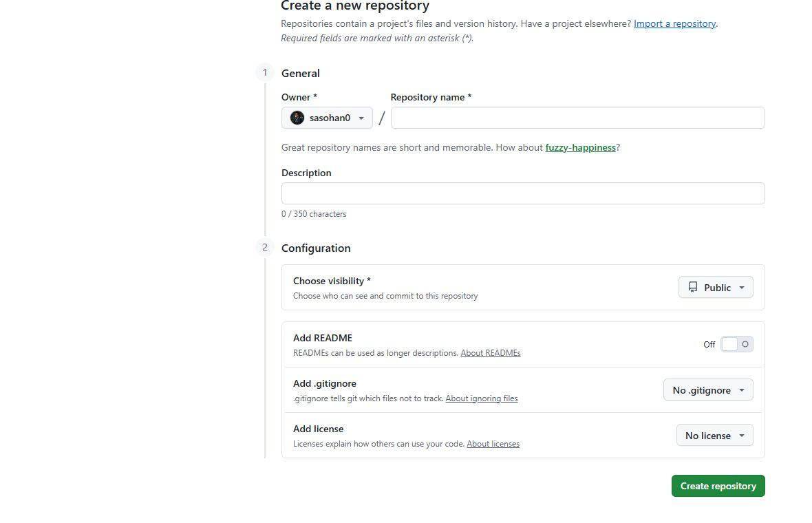
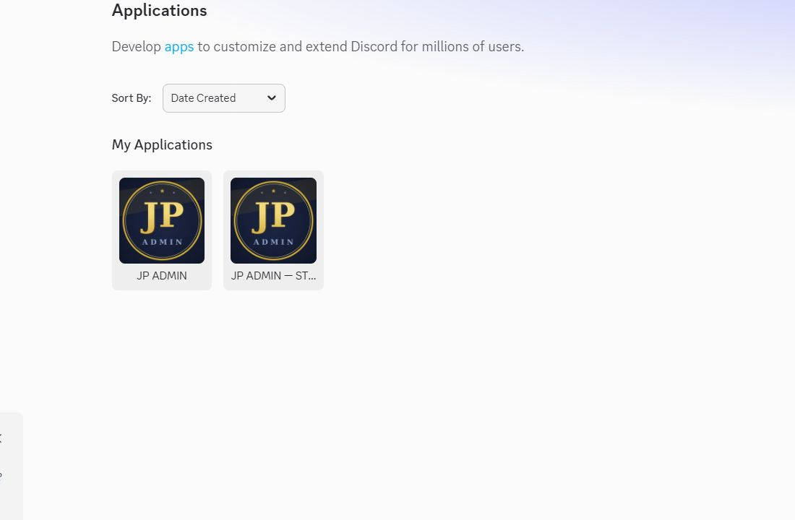
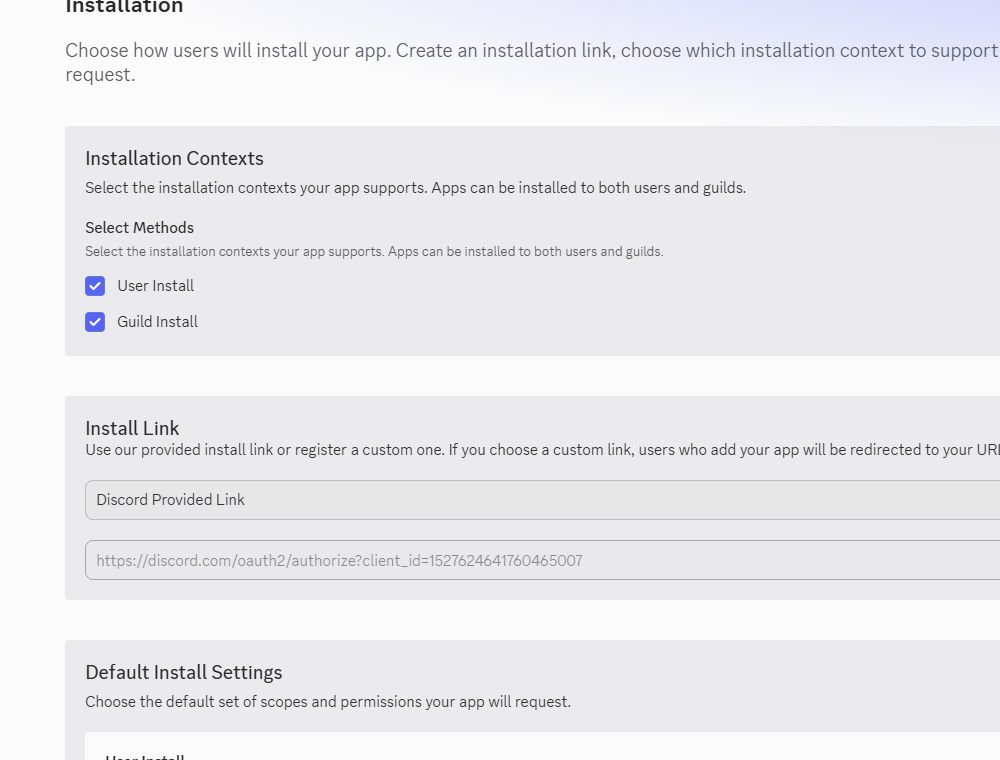
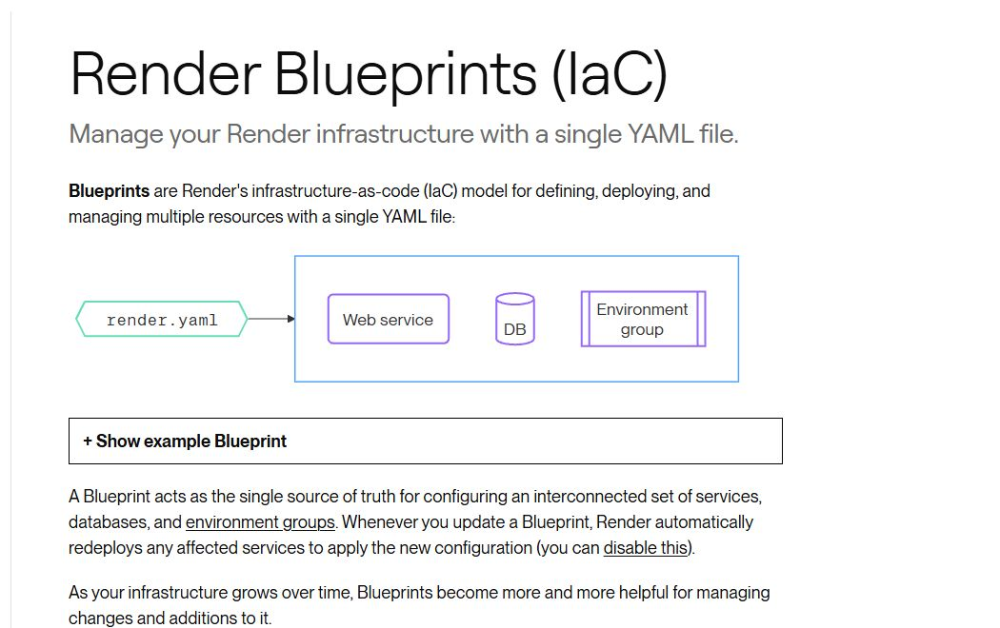
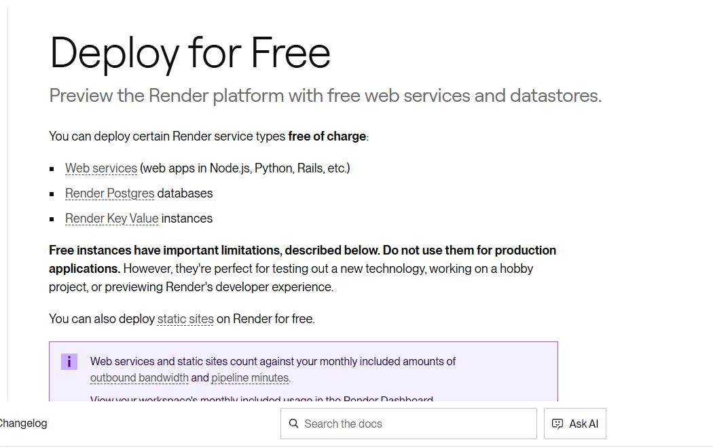
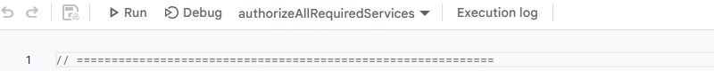

# JP ADMIN — self-hosted Discord bootcamp assistant

JP ADMIN helps mentors operate attendance, job tracking, weekly performance reports, leave requests, onboarding, workshops, outreach, and student records from Discord.

This repository is the safe self-hosted edition. Your copy runs with **your Discord bot, your Render account, your Google Sheet, and your Apps Script deployment**. It does not connect to another mentor's server or data.

No programming experience is required. Keep this page open and complete each checkpoint in order.

> **Safety promise:** setup reuses existing Discord channels before creating missing ones. It does not delete existing channels, messages, Sheet tabs, student rows, or tracker history. Current Discord students can be synchronized even if they never completed intake.

## What you need

- A Discord account that can administer the target server
- A Google account for the cohort Sheet
- Free GitHub and Render accounts
- About 30–45 minutes for the first installation

Never place a Discord bot token or Apps Script secret in GitHub, Discord messages, screenshots, issues, or support chats.

## Checkpoint 1 — create your private copy of this repository

1. At the top of this GitHub page choose **Use this template → Create a new repository**.
2. Choose your account as owner.
3. Name it something like `jp-admin-my-cohort`.
4. Select **Private** and create the repository.
5. Keep that new private repository open. Render will deploy from it.

If **Use this template** is unavailable, choose **Code → Download ZIP** and follow the GitHub Desktop upload instructions in [`SELF_HOSTED_SETUP.md`](SELF_HOSTED_SETUP.md).



Checkpoint complete when `render.yaml` is visible at the top level of your private repository.

## Checkpoint 2 — create the Discord application

1. Open the [Discord Developer Portal](https://discord.com/developers/applications).
2. Choose **New Application** and name it `JP ADMIN - Your Cohort`.
3. Open **Bot** and choose **Reset Token**. Copy the token to a private temporary note; Discord shows it only once.
4. On the same page enable:
   - **Server Members Intent**
   - **Message Content Intent**
5. Save changes.



The token is a password. If it is ever posted or committed, reset it immediately and update only `DISCORD_TOKEN` in Render.

## Checkpoint 3 — invite the bot as Administrator

1. In the Discord Developer Portal open **Installation**.
2. Enable **Guild Install**.
3. Under Guild Install scopes include `bot`.
4. Under permissions select **Administrator**.
5. Copy/open the Discord-provided install link.
6. Select the correct server and approve the invitation.
7. In Discord open **Server Settings → Roles** and move the JP ADMIN bot role above the student identity, readiness, active/inactive, and hired roles it will manage.



Administrator is needed for safe channel matching, private permission repair, role management, pinned panels, and scheduled messages. Discord role hierarchy still applies even to an Administrator bot.

## Checkpoint 4 — deploy your private repository on Render

1. Open [Render Blueprints](https://dashboard.render.com/blueprints).
2. Choose **New Blueprint Instance** and connect your private repository.
3. Render reads `render.yaml` and asks for `DISCORD_TOKEN`.
4. Paste the token only into Render's secret field and create the Blueprint.
5. Wait for the service status to become **Live**.
6. Open `https://YOUR-SERVICE.onrender.com/health`. It must return `OK` with HTTP 200.



This Blueprint creates a free web service, generates `COHORT_API_KEY`, and enables `JP_INSTALLER_MODE`. The placeholder Apps Script URL is expected at this stage.

### About Render's free plan

Render supports `plan: free` for web-service Blueprints. Free services can sleep after an idle period, take time to wake, use an ephemeral local filesystem, and share the workspace's monthly free-instance allowance. Cohort data is durable in Google Sheets/Apps Script, but continuous bot availability is more reliable on an always-on paid instance.



## Checkpoint 5 — open the private Discord setup assistant

1. When the Render service is Live, send `!setup` in your Discord server.
2. JP ADMIN reuses an existing `#bot-admin` channel or creates it if missing.
3. It repairs the channel so ordinary members cannot see it.
4. Continue only in private `#bot-admin`.

The panel has four buttons:

1. **Google permissions**
2. **Match channels**
3. **Sync students**
4. **Verify**

Use **Retry / refresh** after correcting a failed checkpoint. Repeating a failed setup step does not delete data.

If `!setup` does not respond, verify Render is Live, both Discord intents are enabled, and the bot role has Administrator.

## Checkpoint 6 — install and authorize Apps Script

1. Create or open the cohort Google Sheet. Existing student rows can remain.
2. Choose **Extensions → Apps Script**.
3. Replace only the empty starter function with the complete contents of [`Code-v19-FINAL.gs`](Code-v19-FINAL.gs).
4. Near the top of the Apps Script file edit only:
   - `COHORT`: your cohort name
   - `TZ`: your timezone, such as `Asia/Dhaka`
   - `SECRET_KEY`: the generated `COHORT_API_KEY` value from Render **Environment**
5. Save.
6. Select `authorizeAllRequiredServices` in the function selector and choose **Run**.
7. Review and allow the requested Google permissions. Use **Advanced** if Google shows the normal unverified-project notice for your personal script.



The helper checks Spreadsheet, Forms, triggers, Mail/Gmail access, and outbound requests. It sends no email and deletes no data.

Then:

1. Run the Apps Script function `setup` once.
2. Choose **Deploy → New deployment → Web app**.
3. Set **Execute as: Me** and **Who has access: Anyone**.
4. Deploy and copy the final URL ending in `/exec`.
5. In Render open the service's **Environment** page.
6. Replace `COHORT_API_URL` with the `/exec` URL and save.
7. Wait for Render to restart and return to **Live**.

For later Apps Script updates, edit the existing Web App deployment to use a new version. Do not create a new public URL unnecessarily.

## Checkpoint 7 — complete the Discord buttons

Return to private `#bot-admin`, send `!setup`, and complete the four buttons from left to right:

1. **Google permissions** tests the Web App connection.
2. **Match channels** reuses configured or recognized existing channels and creates only missing standard channels.
3. **Sync students** captures current non-bot, non-supervisor server members even without intake. Unverified members receive stable provisional identities until their private profiles are completed.
4. **Verify** checks the backend and protected-channel permissions.

Finish with:

```text
!checkperms
!doctor
!syncmembers
```

These diagnostics suppress mentions and do not ping students. Required backend, permissions, roster, and schedule checks should pass. Optional Groq/AI checks can remain disabled if you intentionally did not add an AI key.

## Checkpoint 8 — start normal cohort operation

Open [`MENTOR_OPERATIONS_GUIDE.md`](MENTOR_OPERATIONS_GUIDE.md) before posting student-facing reports. It provides the full attendance, jobs, leaderboard, leave, and recovery workflows.

Daily essentials:

| Purpose | Start with | Important effect |
| --- | --- | --- |
| Health | `!doctor` | Private; no student ping |
| Permissions | `!checkperms` | Private; no student ping |
| Students | `!syncmembers` | Updates durable roster/tracking rows |
| Attendance | `!formstatus`, then `!openform` / `!closeform` | Open/close posts are student-facing |
| Job trackers | `!checkjobsheets YYYY-MM-DD` | Private read-only audit; no ping/write |
| Combined readiness | `!checkpipelines YYYY-MM-DD` | Private diagnostic |
| Leave review | `!leaves` | Decisions notify only the requesting student |
| Weekly report | `!weeklyreport` | Posts the performance leaderboard |
| Settings | `!control` | Private overview |

All 139 commands are categorized in [`MENTOR_COMMAND_REFERENCE.md`](MENTOR_COMMAND_REFERENCE.md). The running bot's private `!help` command is the authoritative command center.

## Updating your copy later

This public repository is a release source; your private repository owns your deployment.

- For a small update, download the new release ZIP, copy the changed source files into your private repository, review them, commit to `main`, and push. Render redeploys automatically.
- Do not overwrite your Render environment values or Apps Script `CONFIG` secrets.
- When `Code-v19-FINAL.gs` changes, paste the updated code and update the existing Web App deployment to a new version while keeping its `/exec` URL unchanged.
- Run `!doctor`, `!checkperms`, and the relevant private audit after an update.

## Troubleshooting

| Symptom | Safe recovery |
| --- | --- |
| Bot offline | Check Render **Live**, `/health`, then Render logs |
| Discord login error | Reset the Discord token and replace only `DISCORD_TOKEN` in Render |
| `!setup` ignored | Enable both privileged intents and verify Administrator/role hierarchy |
| Apps Script test fails | Verify `/exec`, **Anyone** access, and the matching secret |
| Existing students missing | Enable Server Members Intent, then run `!syncmembers` privately |
| Attendance mismatch | `!checkattendance` → `!repairattendance` → recheck |
| Job count mismatch | `!checkjobsheets <date>` and verify the tracker tab/date; never delete history |
| Channel issue | `!checkperms` → `!repairpermissions`; do not delete channels |
| Duplicate public output | Stop the relevant automation in `!control`, inspect the schedule, and avoid rerunning the public command |

## Privacy and support

- Never open a GitHub issue containing tokens, keys, student names, email addresses, phone numbers, resumes, Sheet exports, or private Discord screenshots.
- Gender and study-stage onboarding answers remain private and never belong in public reports.
- Diagnostics use deliberate mention suppression; commands documented as student-facing should be used intentionally.
- If a secret is exposed, rotate it first. Deleting a GitHub message or issue is not enough.

Read [`SECURITY.md`](SECURITY.md) before reporting a problem. For code details, see [`ARCHITECTURE.md`](ARCHITECTURE.md). For complete setup alternatives, see [`SELF_HOSTED_SETUP.md`](SELF_HOSTED_SETUP.md).

## License

JP ADMIN self-hosted is available under the [MIT License](LICENSE).
